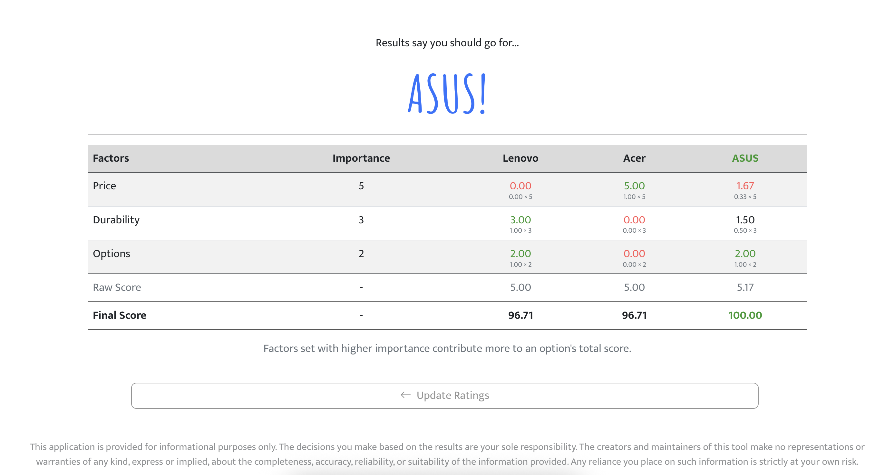
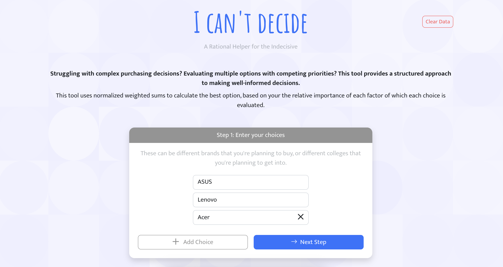
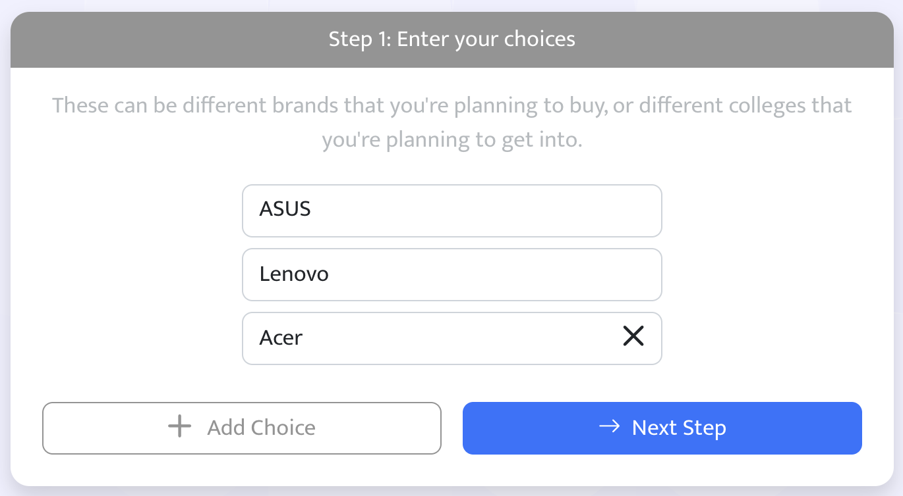
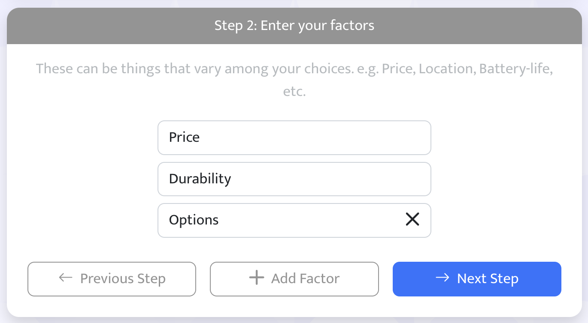
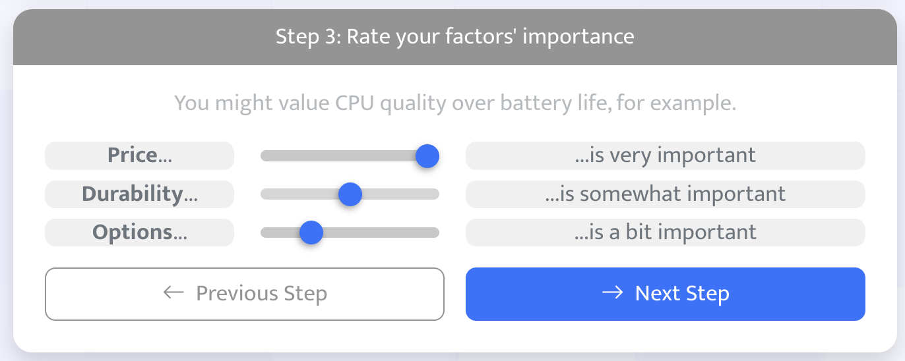
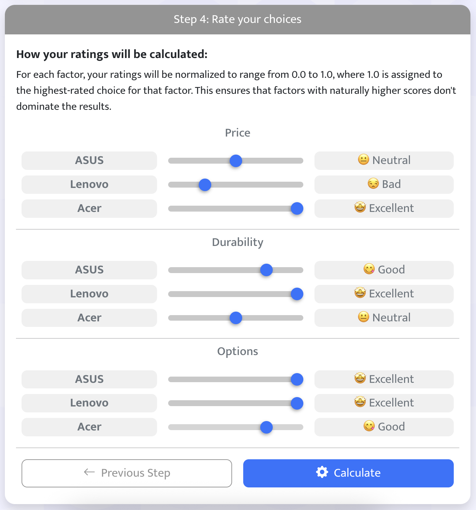

# I Can't Decide

A rational decision-making tool that helps you make well-informed choices by evaluating multiple options against weighted criteria using normalized weighted sums.



---

## How It Works

Struggling with complex purchasing decisions? Evaluating multiple options with competing priorities? This tool provides a structured 5-step approach:

### Step 1 — Enter Your Choices
List the options you're considering — brands, colleges, apartments, or anything else.



### Step 2 — Enter Your Factors
Define the criteria that vary among your choices (e.g., Price, Location, Battery Life).



### Step 3 — Set Factor Importance
Rate how important each factor is to your decision on a 1–5 scale.



### Step 4 — Rate Your Choices
Score each choice on every factor. Ratings are normalized so no single factor dominates the results unfairly.



### Step 5 — View Results
See the calculated scores with a breakdown of how each choice performed across every factor.



---

## Tech Stack

- **React** (Create React App)
- **Bootstrap 5** for styling
- **Bootstrap Icons**
- **react-p5** for the animated background
- **Firebase Hosting** for deployment

---

## Getting Started

### Prerequisites
- Node.js and npm

### Install
```bash
npm install
```

### Run Locally
```bash
npm start
```
Open [http://localhost:3000](http://localhost:3000) to view the app.

### Build
```bash
npm run build
```
Outputs to the `build/` directory, ready for deployment.

### Deploy
```bash
npm run build && firebase deploy
```
The app is hosted on Firebase Hosting.

---

## Project Structure

```
src/
  components/     # React components (forms, results, modals)
  contexts/       # React Context (AppStateContext)
  helpers/        # Utility functions, constants, rating calculations, storage
  hooks/          # Custom hooks (useResize)
  screens/        # Page-level components (Home)
  css/            # Custom styles
public/           # Static assets, favicons, manifest
```

---

## Disclaimer

This application is provided for informational purposes only. The decisions you make based on the results are your sole responsibility. The creators and maintainers make no warranties about the accuracy or suitability of the information provided.
